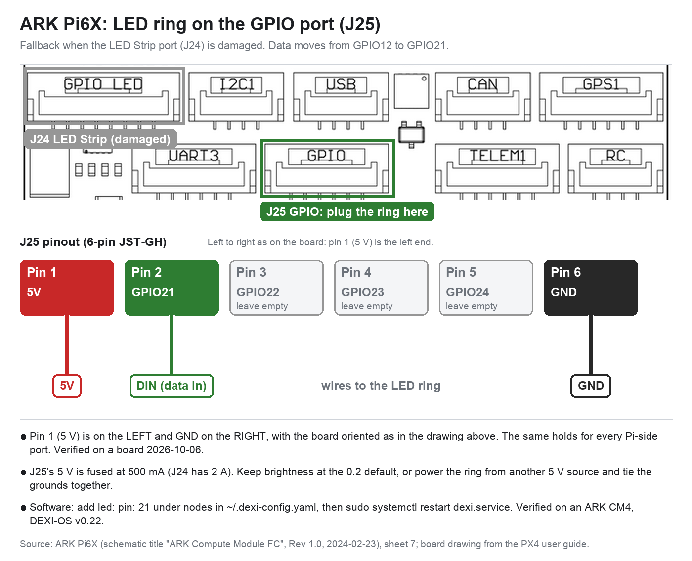

# ARK Pi6X: Pi-side connectors

The ARK Pi6X carries the compute module and breaks some of its GPIO out on JST-GH ports.
Pin numbers come from ARK's schematic ("ARK Compute Module FC" Rev 1.0, sheet 7) and match
the PX4 user guide.

**Orientation:** on every port below, pin 1 (5 V) is on the left and GND on the right, with
the board turned so the connector labels read upright and the ports run along the top edge.

Every GPIO line passes through a 220 ohm series resistor and a TVS array. They are 3.3 V
logic.

| Port | Connector | 5 V fuse | Pins, left to right |
|---|---|---|---|
| LED Strip (J24) | GH 8-pin | 2 A | 5V, 5V, **GPIO12**, GPIO16, GPIO17, GPIO20, GND, GND |
| GPIO (J25) | GH 6-pin | 500 mA | 5V, GPIO21, GPIO22, GPIO23, GPIO24, GND |
| I2C1 (J21) | GH 4-pin | 500 mA | 5V, SCL, SDA, GND |
| UART3 (J22) | GH 6-pin | 500 mA | 5V, TX, RX, CTS, RTS, GND |

## LED ring

The ring's data line is GPIO12, pin 3 of the LED Strip port.

### Moving the ring to the GPIO port

If the LED Strip port is damaged, wire the ring to the GPIO port instead:

| GPIO port pin | Signal | LED ring |
|---|---|---|
| 1 | 5V | 5V |
| 2 | GPIO21 | DIN (data in) |
| 3, 4, 5 | GPIO22 to GPIO24 | leave empty |
| 6 | GND | GND |

Then add this under `nodes:` in `/home/dexi/.dexi-config.yaml` and restart:

```yaml
  led:
    pin: 21
```

```bash
sudo systemctl restart dexi.service
journalctl -u dexi.service --no-pager | grep led_pin   # should report led_pin=21
```

On a CM4, GPIO21 is the only alternative: the LED driver can drive GPIO 10, 12, 18 or 21,
and only 12 and 21 reach a Pi6X port. On a CM5 any GPIO works.

The GPIO port's 5 V is fused at 500 mA, against 2 A on the LED Strip port. Keep the ring at
its default brightness, or power it from another 5 V source with the grounds tied together.


